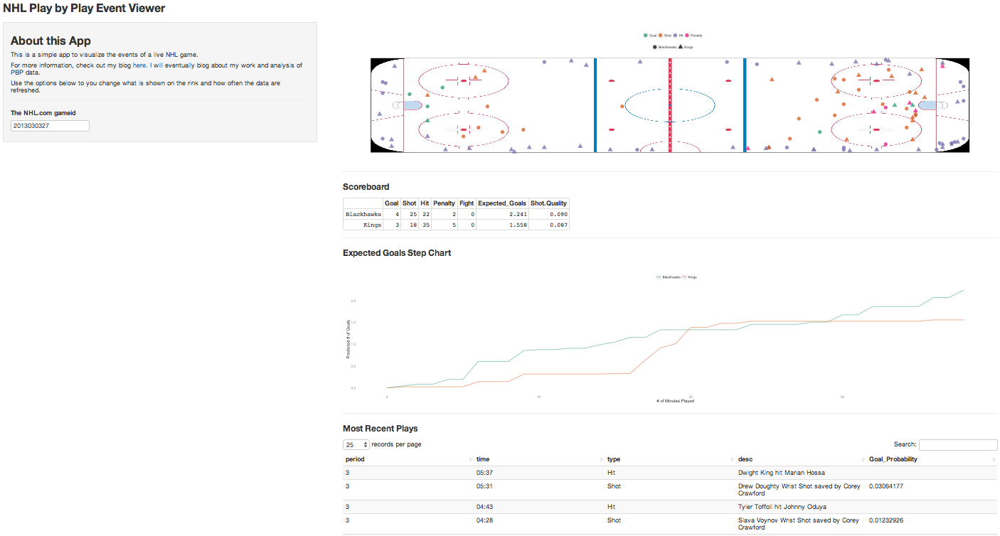

# NHL Play-by-Play Viewer using R Shiny

This repo contains my first-ever [R Shiny](http://www.rstudio.com/shiny/) project.  It's simple, and represents a minimally viable app. It's super basic, but the app allows us to query and visualize the NHL's Play-by-play event logs for a given game.  

The app also leverages a simple shot probability model that I built. 

That repo can [be found here](https://github.com/Btibert3/nhl-pbp).

## A quick screenshot

Clearly this is not a polished, but just a quick highlight of the dashboard app.

## About the Model

In my previous repo, I highlight a very proof-of-concept model. It's not elegant, but very effective when estimating a player's total season goals.  With respect to the point estimates (actual probability of a shot going in), it has some room for improvement; AUC is mid .7's.

The approach I use is simple: fit a logistic regression to predict a given shot going in goal given:

- the distance,  
- shot angle,  
- the wing (left/right)  
- an interaction between distance and angle

When applying the model to every shot from a player (identified by the NHL `playerid`), and correlating the actual versus predicted goals over the course of a season, the `R-squared` is a touch under `.9`. 

## TODO:

- [ ] handle invalid gameids gracefully
- [ ] put some liptsick on this pig
